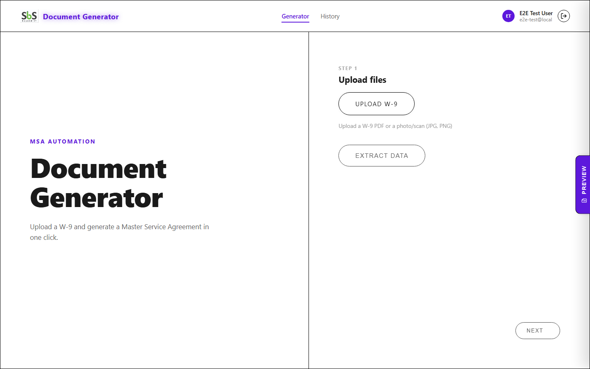
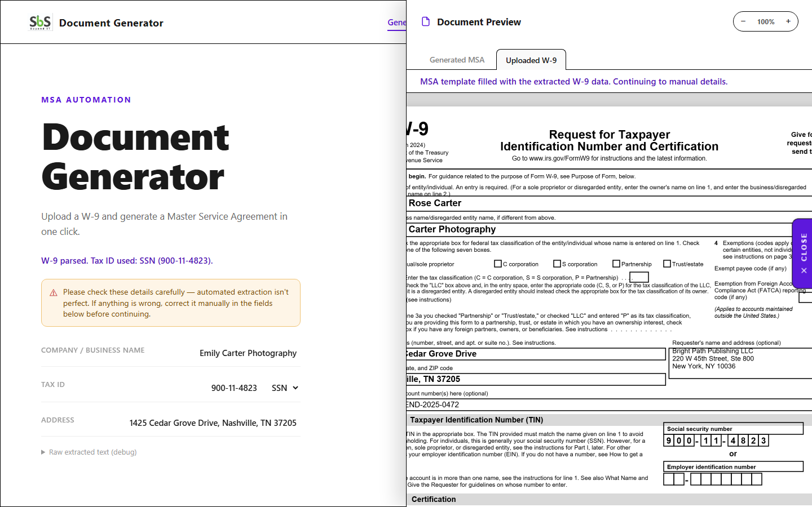
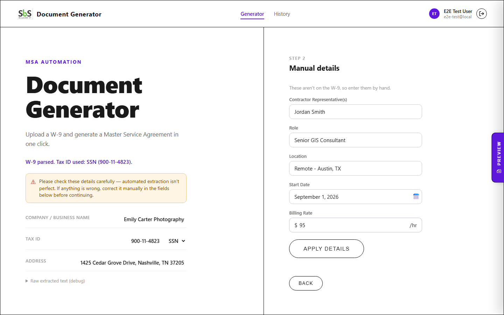
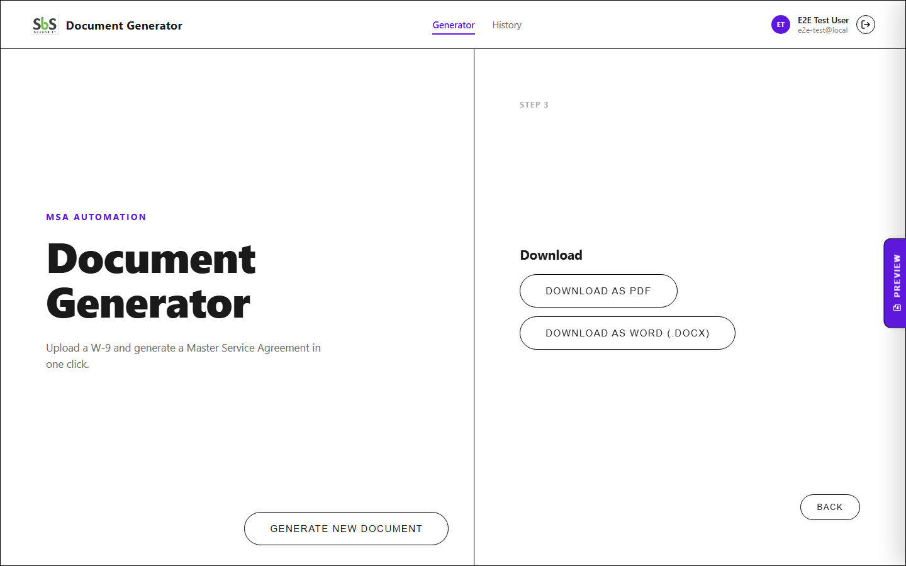
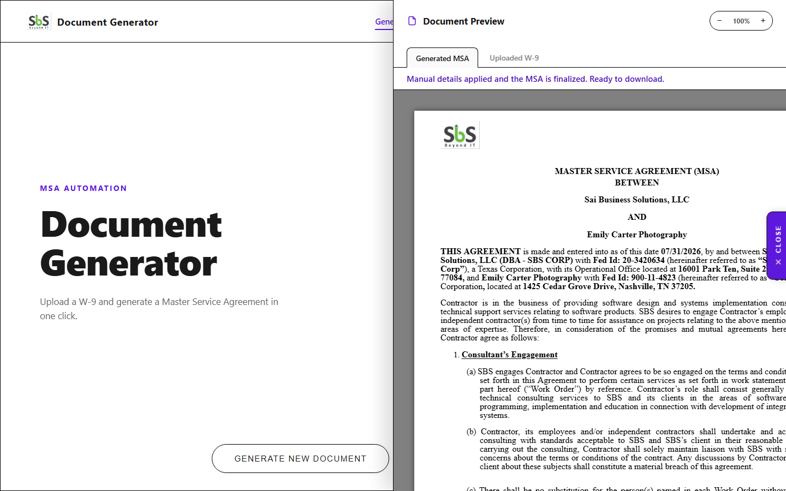
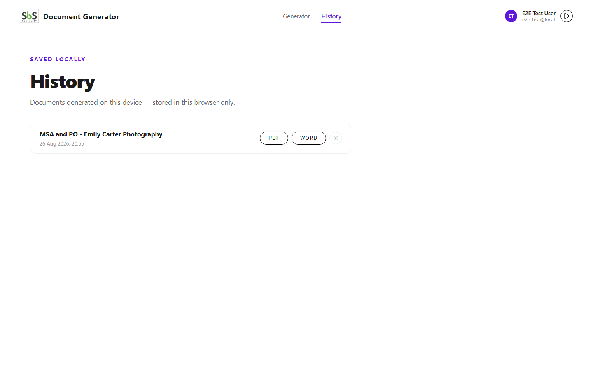
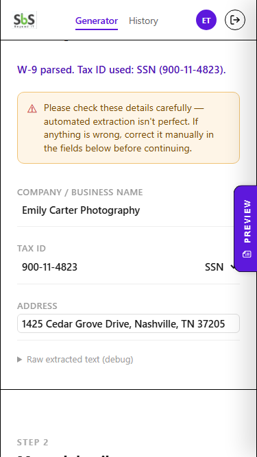
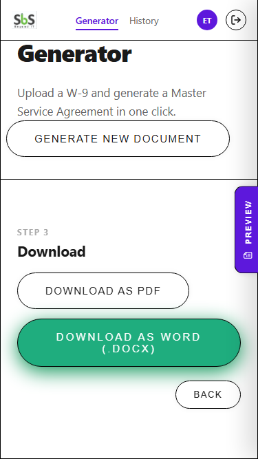
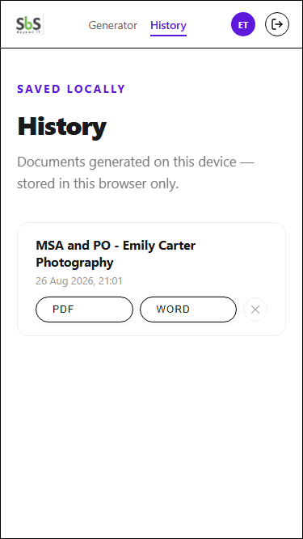

# Workflow

How this app is used end-to-end, and how it's developed, tested, and deployed. Screenshots below are from the actual running app, both desktop and mobile (captured against `test_data/w9_01_individual_clean.pdf`). See [AUTH.md](../AUTH.md) for the authentication setup workflow specifically, and [PROJECT_DOCUMENTATION.md](PROJECT_DOCUMENTATION.md) for the architecture behind each step.

## A. End-user workflow

```
Sign in (Entra ID)
        │
        ▼
┌─────────────────────────────────────────────────────────────┐
│ Step 1 — Upload files                                         │
│   Upload a W-9 → Extract Data → review/edit the extracted     │
│   company name, tax ID, address (MSA template is filled        │
│   automatically behind the scenes)                             │
└──────────────────────┬────────────────────────────────────────┘
                       ▼
┌─────────────────────────────────────────────────────────────┐
│ Step 2 — Manual details                                       │
│   Enter contractor rep, role, location, start date,            │
│   billing rate → Apply Details (this is the step that          │
│   finalizes both output documents)                             │
└──────────────────────┬────────────────────────────────────────┘
                       ▼
┌─────────────────────────────────────────────────────────────┐
│ Step 3 — Download                                              │
│   Download as PDF and/or Word — both are always available      │
└─────────────────────────────────────────────────────────────┘
                       │
                       ▼
        History (optional) — every generated pair of
        files is auto-saved locally in this browser tab;
        re-download or delete anytime from the History view.
        Gone once the tab closes and any tab is reloaded.
```

There is **no separate "upload MSA template" step** — the app ships with one bundled MSA template (`public/assets/msa-template.docx`) that's loaded automatically the first time it's needed.

### 1. Sign in

The first thing anyone sees is the sign-in screen (`#authGate`) — nothing else on the page is reachable, by mouse or keyboard, until sign-in succeeds. Only accounts assigned to this app in Entra ID (plus, optionally, an allow-listed email) can get past it.

### 2. Step 1 — Upload files

Upload a W-9 (PDF, or a photo/scan — JPG, PNG, WEBP, HEIC), then click "Extract Data."

| Empty state | File selected |
|---|---|
|  |  |

The app reads the PDF's text layer directly if it has one (including a fillable/AcroForm W-9's field values); if it's a scanned/photographed W-9 with no usable text, it falls back to OCR — including deskewing a rotated scan and dynamically locating the SSN/EIN and address boxes wherever they actually sit on the page, not just a fixed spot. The extracted company name, tax ID, and address show up in editable fields — correct anything the extraction got wrong before continuing:


You can check the uploaded W-9 itself at any point via the **Document Preview** panel's "Uploaded W-9" tab (opens from the purple tab on the right edge):



### 3. Step 2 — Manual details

Fill in the handful of fields that aren't on a W-9 at all (representative name, role, location, start date, billing rate):


As you type, the **Document Preview** panel's "Generated MSA" tab updates live so you can see the actual document taking shape before committing to it:



Click "Apply Details" to finalize — this is the step where the previous contractor's name/tax ID/address are replaced with the new ones throughout the template, and the manual fields are inserted next to their labels, producing both the PDF and Word versions.

### 4. Step 3 — Download

Download both the PDF and the Word version — both are always full, real generations of the finished document (not a placeholder or a from-scratch summary), since both formats are produced from the exact same replaced document.



Open the Document Preview panel again to review the finished document before downloading:



"Generate New Document" resets the whole wizard back to Step 1 for the next contractor.

### 5. History (anytime)

Switch to the "History" nav tab to see every document generated in the current browser tab, with per-entry re-download and delete:



This is intentionally scoped to the current tab session, not saved forever — see [PROJECT_DOCUMENTATION.md](PROJECT_DOCUMENTATION.md#65-history) for why.

### 6. Sign out

Reloads the page, clearing both the Entra session and any in-memory app state.

### 7. On a phone

The whole flow above works the same way on a phone browser — the desktop's side-by-side layout switches to a single scrolling column below 900px wide, tested down to a ~320–375px-wide screen (iPhone SE-class, the narrowest phone in common use):

| Step 1, reviewing extracted data | Step 3, download | History |
|---|---|---|
|  |  |  |

Everything is reachable by scrolling the page normally (rather than two separately-scrolling panes like on desktop), the nav stays pinned to the top so History/Generator/Sign out are always one tap away, and the Document Preview panel still opens as a full-width panel over the content. See [PROJECT_DOCUMENTATION.md, Section 7](PROJECT_DOCUMENTATION.md#7-presentation-layer) for exactly what changes at each breakpoint and why.

## B. Local development workflow

1. Clone the repo.
2. Install dependencies: `npm install`.
3. One-time Entra setup: follow [AUTH.md Section A](../AUTH.md#a-microsoft-entra-configuration) (App Registration + who's allowed to sign in). This is a manual step in the Entra admin portal — nothing in the repo can do it for you.
4. Point `authConfig.js` (or a `.env` file — see AUTH.md Section G) at the real client ID / tenant ID.
5. Start the dev server: `npm run dev` (Vite). This serves the app over real HTTP with hot reload — you no longer need to run a separate static-file server.
6. Register that exact local origin as a redirect URI in Entra (AUTH.md Section A/F) — this is the step that most often needs redoing when the local dev port changes.
7. Open the dev URL, sign in, and walk through all 3 steps with a real (or test) W-9. Use a file from `test_data/` if you don't have a real one handy.

For a production bundle, use `npm run build` (output goes to `dist/`) and `npm run preview` to sanity-check it locally.

## C. Testing workflow

- **`npm run test:extraction`** (`tests/w9-extraction.test.js`, Playwright): runs every fixture in `test_data/` through the real extraction pipeline in a real browser and diffs the result against `tests/w9-extraction-snapshot.json`. Flags new/changed/regressed results; re-run with `UPDATE_SNAPSHOT=1` to accept an intentional change into the baseline.
- **`npm test`** (`tests/e2e.js`, Playwright): drives the app through the full wizard — upload, extract, manual details, download, History — end to end.
- Both test scripts (and `tests/_screenshots.mjs`, used to capture the images in this document) rely on the dev-only `VITE_E2E_BYPASS_AUTH=true` flag (see `.env.e2e`) to skip the real Entra sign-in flow.
- **Manual security/auth smoke test** (do this after any change to `auth.js`/`auth-ui.js`/`authConfig.js`/`index.html`'s gate markup): sign in with an assigned account, reload (confirm silent restore), sign out, attempt sign-in with a non-assigned account (confirm Entra itself refuses it), and — specifically — **press Tab repeatedly from the sign-in screen and confirm focus never lands on anything behind it** (nav links, wizard controls). See [AUTH.md Section H](../AUTH.md#h-security-checklist-before-deployment) for the full checklist.
- **Manual extraction spot-check**: run a real (or synthetic/dummy) W-9 through Step 1 and confirm company name / tax ID / address come out correctly for both a text-layer PDF and a scanned/OCR'd one.
- **Manual generation spot-check**: confirm the previous contractor's details don't remain visible/selectable anywhere in the generated PDF (this is engineered around by always rasterizing the finished document into the PDF — see PROJECT_DOCUMENTATION.md Section 6.4).

## D. Change/contribution workflow

- **Vendored dependency updates** (`vendor/*.esm.js`, Tesseract's worker/core/lang files): follow the exact steps in [vendor/README.md](../vendor/README.md#updating-a-version) — fetch, check for further nested imports, record the new SHA-512, update the version in the importing file's path.
- **npm dependency updates** (`pdfjs-dist`, `pdf-lib`, `docx-preview`, `html2canvas`, `tesseract.js`): a normal `npm update`/`package.json` bump, since these are resolved by Vite at build time, not vendored.
- **Replacing the MSA template**: `script.js`'s constants describing the template's own previous placeholder text (company name/tax ID/address to search-and-replace, and manual-field label text) are tuned to the one bundled template at `public/assets/msa-template.docx`. Supporting a different template means replacing that file *and* updating those constants — dropping in a different `.docx` alone does not work.
- **Auth changes**: read [AUTH.md](../AUTH.md) first — it documents the security reasoning behind every non-obvious choice (redirect vs. popup, sessionStorage cache, etc.), so a change that looks like an improvement in isolation may reintroduce an already-solved problem.
- **Any change touching the auth gate's DOM** (`#authGate`, `#introOverlay`, `<nav>`, `#historyView`, `#mainStage`): re-run the keyboard Tab-through check above. A prior version of this gate was CSS-only and could be bypassed via keyboard focus — see AUTH.md's security-explanation section for what fixed that (the `inert` attribute) and don't remove it without an equivalent replacement.
- **Retaking screenshots for this document**: run `node tests/_screenshots.mjs` for the desktop screenshots, or `node tests/_mobile_screenshots.mjs` for the mobile ones (both need the Playwright browsers already installed under `tests/node_modules`, same as the other tests) — each walks the whole wizard against `test_data/w9_01_individual_clean.pdf` and overwrites its half of `docs/screenshots/`.
- **Changing the responsive layout**: the breakpoints live in `style.css` at `@media (max-width: 900px)` (switches from the desktop split-screen to a single scrolling column), `640px`, and `480px` — see [PROJECT_DOCUMENTATION.md, Section 7](PROJECT_DOCUMENTATION.md#7-presentation-layer) for what each one does and why. Two things are easy to get wrong here if you're not aware of them: (1) any element inside a `display: flex` container silently shrinks to fit a narrower container unless it has `flex-shrink: 0` — this bit the intro overlay's animation once already; (2) anything positioned with `position: fixed` and a JS-computed `top`/`left` (like the wizard's loading overlay, `positionWizardLoading()` in `script.js`) needs to account for the fact that the mobile layout lets the whole page scroll, so a rect captured once at trigger time can go stale — check `window.innerWidth` and fall back to a viewport-relative position on mobile instead of trusting a cached element rect.
- **Changing the logo/branding**: it's a single file, `public/assets/logo.jpg`, referenced from `index.html`'s `.brand-logo` — replace the file (same filename) to swap it, no code change needed. It was originally extracted from the bundled MSA template's own embedded image (`word/media/image1.jpg` inside the `.docx`, which is a zip file) rather than uploaded separately, so it stays in sync with what the generated documents themselves show.

## E. Deployment workflow

This is a static site once built — any static host works (Azure Static Web Apps, Netlify, GitHub Pages, an S3 bucket + CDN, or a plain web server). Run `npm run build` and deploy the contents of `dist/`. See [AUTH.md Section G](../AUTH.md#g-production-deployment-instructions) for the auth-specific parts (registering the production redirect URI, HTTPS requirement, production environment variables). There is no database or backend to deploy — deploying is "build, then copy `dist/` to a static host over HTTPS."
